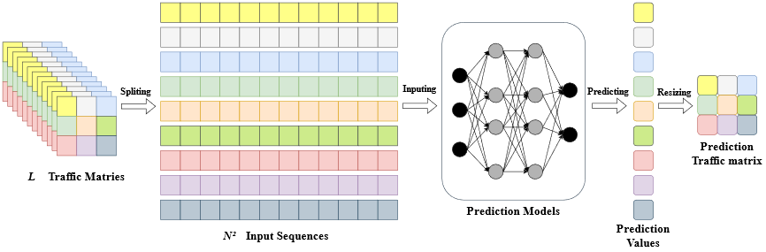

# Flow By Flow traffic prediction

## Introduction
This repo is the implementation of "Flow-by-flow traffic matrix prediction methods: Achieving accurate, adaptable, low cost results" (Computer Communications).  
link：https://doi.org/10.1016/j.comcom.2022.07.052


## Problem Statement
In this paper, a flow-by-flow method is proposed for TM prediction. For a certain original node i and destination node $j, X_(i,j)^t$ denotes the traffic volume measured during time slot t on this OD flow. The traffic volume for each OD flow can be prediction separately.
$X_(i,j)^t=G(X_(i,j)^(t-1),X_(i,j)^(t-2),…,X_(i,j)^(t-L) )，∀i,j∈[1,N]$
The $N^2$ flows are predicted one-by-one using the above predictor G, and the next TM $X^t$ is obtained finally. We call this method the flow-by-flow prediction. The pipeline is shown in Fig. 1.



Fig. 1 The pipeline of flow-by-flow TM prediction. 


## Dataset
Two publicly available datasets are utilized to validate the proposed prediction method, namely the Abilene and GÉANT datasets. They provide the statistical traffic volume data of the real network traffic trace from the American Research and Education Network (Abilene)  and the Europe Research and Education Network (GÉANT) .

| **Topology** | **Nodes** | **Flows** | **Links** | **Interval** | **Horizon** | **Records** |
| ------------ | --------- | --------- | --------- | ------------ | ----------- | ----------- |
| **Abilene**  | 12        | 144       | 15        | 5 min        | 6 months    | 48046       |
| **GÉANT**    | 23        | 529       | 38        | 15 min       | 4 months    | 10772       |


## Results

| **Dataset** | **Prediction Type** | **Model**      | **MSE(**×10-4**)**  **(1/2/3 TMs)** | **MAE(**×10-2**)**  **(1/2/3 TMs)** |
| ----------- | ------------------- | -------------- | ----------------------------------- | ----------------------------------- |
| **Abilene** | Classical method    | ARIMA          | 89.74/179.48/269.25                 | 5.25/10.50/15.76                    |
|             | Classical method    | SVR            | 52.03/67.20/77.78                   | 5.94/6.84/7.32                      |
|             | Time series         | LSTNet [29]    | 12.33/18.68/22.90                   | 2.09/2.43/2.65                      |
|             | Time series         | TST [39]       | 21.76/31.05/34.88                   | 2.60/3.13/3.28                      |
|             | Time series         | MLP [42]       | 40.11/46.96/48.67                   | 3.59/3.78/3.84                      |
|             | Time series         | ResNet [42]    | 40.16/44.39/50.49                   | 3.81/3.99/4.26                      |
|             | Time series         | TCN [43]       | 57.74/58.81/59.36                   | 4.21/4.29/4.24                      |
|             | TM (entire matrix)  | LSTM-FFNN [44] | 26.00/-/-                           | -/-/-                               |
|             | TM (entire matrix)  | CRNN [1]       | 8.91/9.66/**10.25**                 | 1.47/**1.48/1.54**                  |
|             | TM (entire matrix)  | DCRNN[6]       | 24.53/34.02/35.99                   | 3.11/3.87/3.99                      |
|             | TM (entire matrix)  | STGCN[45]      | 31.17/34.13/36.55                   | 3.17/3.29/3.49                      |
|             | TM (entire matrix)  | MTGNN[27]      | 10.60/13.05/15.04                   | 1.63/1.76/1.86                      |
|             | TM (flow-by-flow)   | LSTM           | **7.97**/**9.65**/11.17             | **1.40**/1.53/1.67                  |
|             | TM (flow-by-flow)   | GRU            | 8.59/11.62/12.30                    | 1.49/1.70/1.79                      |
|             | TM (flow-by-flow)   | Transformer    | 8.13/10.02/11.44                    | 1.48/1.59/1.72                      |
| **GÉANT**   | Classical method    | ARIMA          | 24.02/48.05/72.09                   | 1.47/2.94/4.40                      |
|             | Classical method    | SVR            | 77.62/106.69/115.97                 | 8.40/9.35/9.79                      |
|             | Time series         | LSTNet [29]    | 8.28/9.11/9.38                      | 1.05/1.16/1.17                      |
|             | Time series         | TST [39]       | 12.77/12.93/13.25                   | 1.69/1.65/1.69                      |
|             | Time series         | MLP [42]       | 15.29/16.03/16.34                   | 1.38/1.38/1.40                      |
|             | Time series         | ResNet [42]    | 18.38/20.47/21.38                   | 1.97/2.11/2.09                      |
|             | Time series         | TCN [43]       | 19.24/20.29/21.92                   | 1.51/1.56/1.64                      |
|             | TM (entire matrix)  | LSTM-FFNN [44] | 5.80/-/-                            | -/-/-                               |
|             | TM (entire matrix)  | CRNN [1]       | 10.10/10.30/10.50                   | 1.00/1.08/1.19                      |
|             | TM (entire matrix)  | DCRNN[6]       | 15.91/15.97/18.68                   | 2.33/2.28/2.52                      |
|             | TM (entire matrix)  | STGCN[45]      | 11.24/11.58/13.25                   | 1.57/1.63/1.64                      |
|             | TM (entire matrix)  | MTGNN[27]      | 7.35/8.17/8.44                      | 1.07/1.11/1.11                      |
|             | TM (flow-by-flow)   | LSTM           | **3.91/4.80/5.44**                  | 0.55/0.62/**0.64**                  |
|             | TM (flow-by-flow)   | GRU            | 3.92/4.88/5.45                      | **0.53/0.61/**0.71                  |
|             | TM (flow-by-flow)   | Transformer    | 3.99/5.97/6.88                      | 0.68/0.93/1.04                      |


## Environment

python=3.7.9

torch==1.7.0

tsai==0.3.0

numpy==1.19.2

...

*more details can be found at pytorch-gpu.yml.

## Getting Started

### Entire matrix prediction

```
python matrix_train.py
```

### Flow-By-Flow prediction

```python
python single_flows.py
```

### Partial Training

using by-flow down-sampling

```python
python sample_flow.py
```

using by-time down-sampling

```python
python sample_time.py
```

...

## Citation

...
## Reference
[1] K. Gao, D. Li, L. Chen, J. Geng, F. Gui, Y. Cheng, Y. Gu, Predicting traffic demand matrix by considering inter-flow correlations, in: IEEE INFOCOM 2020-IEEE Conference on Computer Communications Workshops (INFOCOM WKSHPS), IEEE, 2020, pp. 165–170.  
[6] D. Andreoletti, S. Troia, F. Musumeci, S. Giordano, G. Maier, M. Tornatore, Network traffic prediction based on diffusion convolutional recurrent neural networks, in: IEEE INFOCOM 2019-IEEE Conference on Computer Communications Workshops (INFOCOM WKSHPS), IEEE, 2019, pp. 246–251.  
[27] Z. Wu, S. Pan, G. Long, J. Jiang, X. Chang, C. Zhang, Connecting the dots: Multivariate time series forecasting with graph neural networks, in: Proceedings of the 26th ACM SIGKDD International Conference on Knowledge Discovery & Data Mining, 2020, pp. 753–763.  
[29] G. Lai, W.-C. Chang, Y. Yang, H. Liu, Modeling long-and short-term temporal patterns with deep neural networks, in: The 41st International ACM SIGIR Conference on Research & Development in Information Retrieval, 2018, pp. 95–104.  
[39] G. Zerveas, S. Jayaraman, D. Patel, A. Bhamidipaty, C. Eickhoff, A transformer-based framework for multivariate time series representation learning, in: Proceedings of the 27th ACM SIGKDD Conference on Knowledge Discovery & Data Mining, 2021, pp. 2114–2124.  
[42] Z. Wang, W. Yan, T. Oates, Time series classification from scratch with deep neural networks: A strong baseline, in: 2017 International joint conference on neural networks (IJCNN), IEEE, 2017, pp. 1578–1585.  
[43] S. Bai, J. Z. Kolter, V. Koltun, An empirical evaluation of generic convolutional and recurrent networks for sequence modeling, arXiv preprint arXiv:1803.01271  
[44] L. A. Mesquita, K. D. Assis, L. V. Pinho, R. C. Almeida Jr, E. F.Simas Filho, M. S. Alencar, Resource planning on elastic optical networks using traffic matrix prediction, AEU-International Journal of Electronics and Communications 134 (2021) 153615.  
[45] B. Yu, H. Yin, Z. Zhu, Spatio-temporal graph convolutional networks:a deep learning framework for traffic forecasting, in: Proceedings of the 27th International Joint Conference on Artificial Intelligence,2018, pp. 3634–3640.

